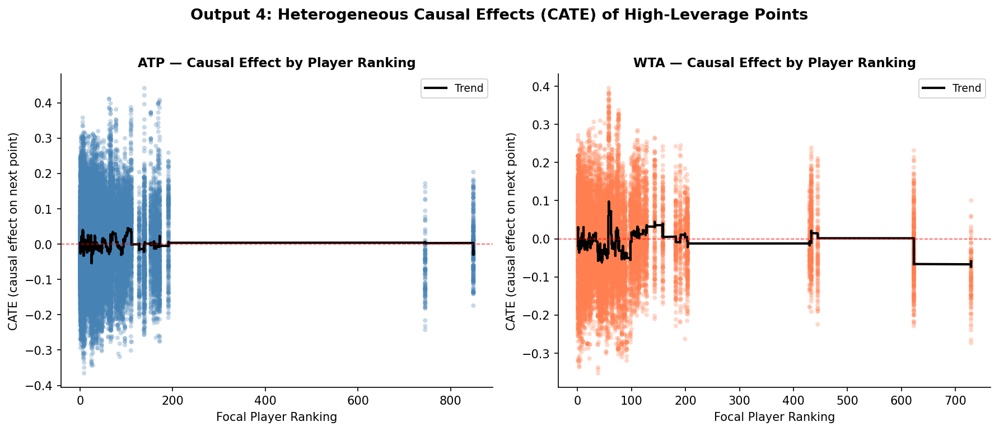

It is the fourth set of the 2023 Wimbledon final. Carlos Alcaraz, twenty years old, has just saved a break point with a forehand winner down the line that the crowd will talk about for years. The commentators erupt. Novak Djokovic, standing at the baseline with twenty-three Grand Slam titles behind him, rolls his neck and bounces on his toes. The stadium is unanimous: something has shifted. The momentum, every pundit agrees, belongs to Alcaraz now.

He went on to win the match. And the narrative wrote itself.

The crowd saw a turning point. The commentators called it a psychological breakthrough. Djokovic's body language told the same story. In that moment, fifteen thousand people in the stands and millions watching at home reached the same conclusion: winning that break point had changed something fundamental about the match. The next points, they felt, would follow inevitably.

But here is the question that data forces us to ask: did winning that point actually make the next one more likely to go his way? Or did the crowd, the commentators, and even Djokovic himself fall for one of sport's oldest statistical illusions?

The debate over momentum in sport is older than professional tennis itself. In 1985, psychologists Gilovich, Vallone and Tversky published what became the most cited paper in sports statistics, arguing that the "hot hand" in basketball was a cognitive illusion. Fans and players were pattern-matching on random sequences, seeing structure in noise. Their conclusion was blunt: streaks happen by chance, and momentum is a story we tell ourselves.

The debate never settled. In 2018, economists Miller and Sanjurjo showed that Gilovich's original analysis contained a subtle mathematical flaw: a streak selection bias that caused genuine persistence in performance to be systematically underestimated. The hot hand, they argued, had been buried prematurely.

More recently, Du et al. (2025) attempted to validate momentum in tennis using analysis and machine learning across just 31 Wimbledon matches. They found evidence of momentum, but 31 matches is a thin foundation for a claim this bold.

This project tests the same claim at a scale that has never been attempted before. We analysed every point played across all four 2023 Grand Slams (the Australian Open, Roland Garros, Wimbledon and the US Open) across both the ATP and WTA tours. That is 52,314 points, 275 matches, and 155 players. And we did not just look for correlation. We looked for causation.

## The Data: Every Point, Every Grand Slam

The raw data comes from Jeff Sackmann's Match Charting Project, a volunteer-compiled record of every point played in professional tennis, including the exact score state at each moment. This allowed us to identify the highest-pressure situations in the game with precision: break points, where the returner stands one point away from winning the service game, and tiebreak points, where an entire set hangs in the balance. We called these high-leverage moments. Across the ATP tour, 27% of all points in our dataset fell into this category, more than one in four points was played under genuine pressure. Before any analysis could begin, the raw data required substantial preparation: matching player names across separate datasets, filtering to main draw matches only, removing retirements and walkovers, and standardising score formats across tens of thousands of individual points. We also drew on official ATP and WTA rankings to measure each player's baseline skill level, ensuring that any effect we found could not simply be explained by better players playing better tennis.

Crucially, we kept the ATP and WTA tours completely separate throughout the entire analysis. Mixing them together would risk masking tour-specific patterns: what is true for men's tennis is not necessarily true for women's tennis, and treating them as one dataset would have obscured exactly the kind of comparison that turns out to matter most. It is worth noting that ATP matches are played best of five sets while WTA matches are played best of three — meaning ATP matches generate more points per match on average, which partly explains the larger ATP dataset.

## Does Momentum Even Show Up in the Data?

Before asking whether momentum causes anything, we first need to ask whether it exists at all. The simplest test is to ask: does winning a point make the next one more likely to go your way? We ran this test for every player individually (77 ATP players and 78 WTA players) rather than pooling everyone together, which would risk hiding individual patterns inside aggregate noise.

The results in Figure 1 are the first blow to the momentum theory. In the ATP, just 9.1% of players showed statistically significant evidence that their point sequences were non-random. In the WTA, 7.7%. At a 5% significance threshold, random chance alone would produce roughly 5% significant results. Our figures barely exceed that. Across both tours, momentum, if it exists, is present in fewer than one in ten players.

To visualise what this looks like in a real match, Figure 2 tracks the cumulative drift in performance for a single WTA match between Ekaterina Alexandrova and Madison Brengle. The line rises when the focal player is winning points above her average rate, and falls when she drops below it. Think of it as a running score of whether a player is outperforming or underperforming their own average. A genuine momentum effect would look like a sustained climb, with the player catching fire and staying hot. If momentum were real and powerful, we would expect to see long stretches where the line keeps climbing in one direction.

What we actually see is oscillation. The line moves up, reverses, recovers, and reverses again. There are no sustained directional runs of the kind that a momentum narrative would predict. The pattern looks far more like the natural variance of a competitive match than evidence of a psychological force building behind one player.

## What About the Biggest Moments?

Perhaps momentum does not operate across an entire match; perhaps it concentrates in the highest-pressure moments. Break points. Tiebreaks. The moments where crowds hold their breath and commentators reach for their most dramatic vocabulary.

We tested this directly. For every player, we calculated their Tiebreak Over-Expectation, measuring how much better or worse they performed in tiebreaks compared to what their overall skill level would predict. If certain players consistently raise their game when it matters most, we would expect to see clear outliers pulling away from zero in Figure 3.

The points cluster tightly around zero. There is no consistent clutch performer who systematically over-delivers under pressure, and no consistent choker who systematically under-delivers. A few players sit at the extremes in both directions, but the pattern is exactly what we would expect from random variation across a single season, not evidence of a repeatable clutch skill that separates the great from the good.

## Correlation or Causation?

Everything so far has tested whether momentum correlates with winning the next point. But correlation is not causation. A player who is already dominating will naturally win more break points; the association might simply reflect that good players win more of everything, not that winning one big point causes them to win the next.

To isolate the true causal effect, we use a causal forest to estimate whether winning a pressure point causes a higher probability of winning the next — not just correlates with it.

This approach controls for everything else (player ranking, recent form, match context) and asks: holding all of that constant, does winning a high-leverage point actually shift what happens next?

Figure 4 shows the estimated causal effect for every observation in the dataset, plotted against player ranking. If momentum were real, we would expect to see a consistent positive effect, with points clustered above zero, indicating that winning a pressure point reliably lifts the probability of winning the next. Instead, the scatter sits around zero across all ranking levels. Top-ranked players show no more momentum effect than qualifiers. The effect is absent everywhere.

Figure 5 confirms this numerically. The Average Treatment Effect (the average causal impact of winning a high-leverage point on the probability of winning the next) is -0.0009 for ATP and -0.0098 for WTA. Both are statistically indistinguishable from zero. In plain terms: winning a pressure point does not cause you to win the next one.

## If Not Momentum, Then What?

If momentum does not drive point outcomes, what does? Figure 6 shows which variables actually matter, ranked by how much explanatory power they carry in our model.

Rolling win percentage dominates by a significant margin. A player's recent form over the last ten points is far more predictive of their next point than any momentum variable: more than their cumulative performance trend, more than whether they just won a break point, more than their winning streak length. This is consistent with skill persistence rather than momentum. Good players win more points because they are better, and they keep doing so consistently, not because of any force that builds across consecutive points.

## The Uncomfortable Conclusion

Across 52,314 points, two tours, and four Grand Slams, the data tells a consistent story. Momentum, in the sense of winning a pressure point causally driving the next result, does not appear to exist in professional tennis at this scale.

The comparison between tours adds an intriguing wrinkle. The ATP causal estimate sits at -0.0009, so close to zero it is essentially a flatline. The WTA estimate is -0.0098, still statistically indistinguishable from zero, but pointing slightly negative. If anything, the WTA data hints at a small hangover effect: winning a high-pressure point may if anything marginally reduce the probability of winning the next one, perhaps because of the physical and mental effort required to convert it. This is speculative, and the effect is too small to be conclusive, but it is the opposite of what the momentum narrative predicts. Both tours point firmly away from momentum being a real causal force.

This does not mean psychology plays no role in sport. What it does mean is that the narrative (*he has the momentum now*) is almost certainly a story imposed by human observers on a process that is, at the point level, much closer to random than it feels from the stands.

There are honest limitations to acknowledge. This dataset covers one season. Attenuation bias, the tendency for measurement imprecision to push causal estimates toward zero, means our findings likely represent an upper bound on the true null rather than a precise measurement of nothing. A richer dataset across multiple seasons would sharpen the inference considerably.

But the burden of proof lies with those who claim momentum exists. At Grand Slam scale, with causal methods, across both tours, the evidence is not there.

The next time a commentator says Alcaraz has all the momentum, the most statistically accurate response is: the data says otherwise. What he has is a higher rolling win percentage. And that, it turns out, is the whole story.

---

*Data: Jeff Sackmann Match Charting Project and ATP/WTA official results (2023). Full code and replication instructions at: https://github.com/flynnpresence/BEE2041-tennis-momentum*
