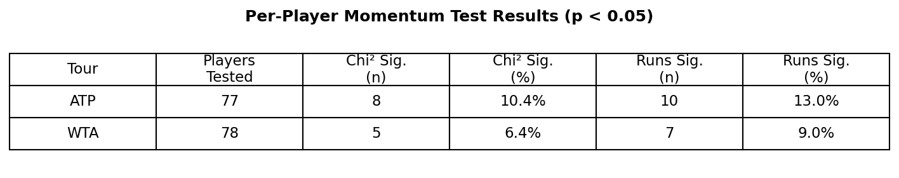
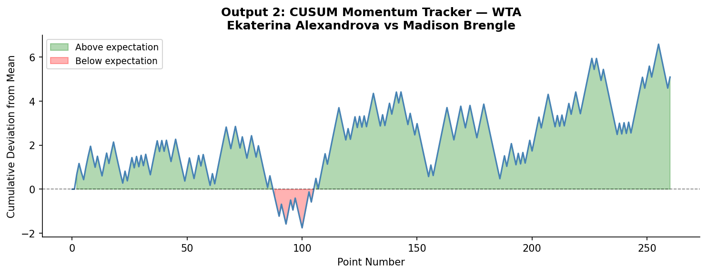
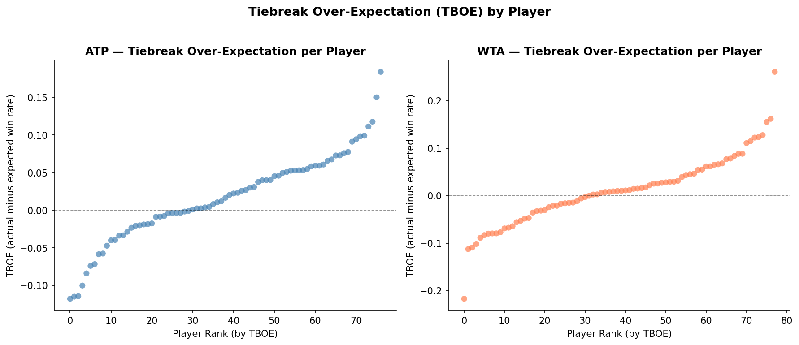
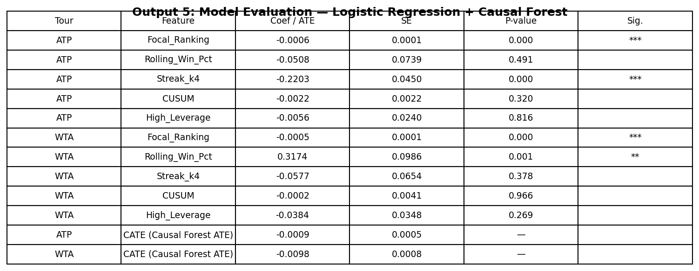
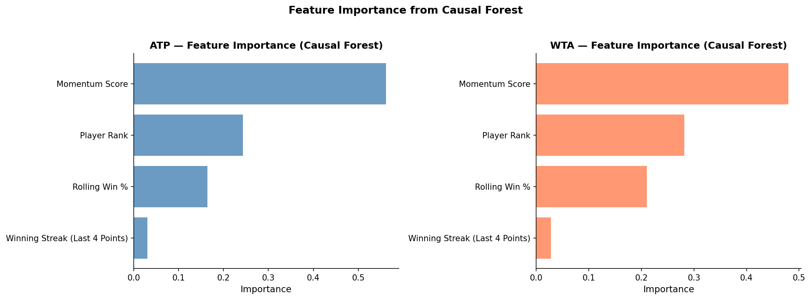

```{=html}
<div class="hero-banner">

  <div class="hero-banner__overlay"></div>

  <div class="hero-banner__court">
  <svg class="bounce-svg" viewBox="0 0 800 120" xmlns="http://www.w3.org/2000/svg">
    <ellipse cx="120" cy="108" rx="14" ry="4" fill="rgba(0,0,0,0.2)"/>
    <ellipse cx="280" cy="108" rx="11" ry="3" fill="rgba(0,0,0,0.2)"/>
    <ellipse cx="440" cy="108" rx="8" ry="2.5" fill="rgba(0,0,0,0.2)"/>
    <ellipse cx="580" cy="108" rx="6" ry="2" fill="rgba(0,0,0,0.2)"/>
    <circle class="tennis-ball" r="14" fill="#c8e63c"/>
  </svg>
  </div>

  <div class="hero-banner__content">
    <div class="hero-banner__eyebrow">A Data Science in Economics Project · 2026</div>
    <h1 class="hero-banner__title">The Wrong Kind of Momentum</h1>
    <p class="hero-banner__dek">
      Why break points kill momentum and tiebreaks create it.
    </p>
    <div class="hero-banner__meta">
      <div><span>Author</span><span>Flynn Presence</span></div>
      <div><span>Module</span><span>BEE2041 · University of Exeter</span></div>
    </div>
  </div>
</div>
```

It is the fourth set of the 2023 Wimbledon final. Carlos Alcaraz, twenty years old, has just saved a break point with a forehand winner down the line. The commentators erupt. Novak Djokovic rolls his neck and bounces on his toes. The stadium is unanimous: something has shifted. The momentum, every pundit agrees, belongs to Alcaraz now.

He went on to win the match. The narrative wrote itself.

But did winning that break point actually make the next one more likely to go his way? Or did fifteen thousand people in the stands and millions watching at home just fall for one of sport's oldest statistical traps?

In 1985, psychologists Gilovich, Vallone and Tversky published one of the most influential papers in sports statistics, arguing that the "hot hand" in basketball was a cognitive illusion. Fans and players were pattern-matching on random sequences. Their conclusion was blunt: streaks happen by chance, and momentum is a story we tell ourselves.

The debate never settled. In 2018, economists Miller and Sanjurjo showed that Gilovich's original analysis contained a subtle mathematical flaw, a streak selection bias that caused genuine persistence in performance to be systematically underestimated. The hot hand, they argued, had been buried prematurely.

More recently, Du et al. (2025) tracked momentum in tennis using CUSUM charts across 31 Wimbledon matches and found evidence it exists, but 31 matches is a thin foundation, and their approach measures correlation, not cause.

This project runs the same test at a different scale entirely. Every point played across all four 2023 Grand Slams, the Australian Open, Roland Garros, Wimbledon and the US Open, across both the ATP and WTA tours. 52,314 points, seven times the size of the most recent tennis momentum study. What we found is more interesting than a simple yes or no.

## The Data: Every Point, Every Grand Slam

::: {.stats-grid}

::: {.stat}
<div class="stat__value" data-count="52314">52,314</div>
<div class="stat__label">Points Analysed</div>
:::

::: {.stat}
<div class="stat__value" data-count="275">275</div>
<div class="stat__label">Grand Slam Matches</div>
:::

::: {.stat}
<div class="stat__value" data-count="155">155</div>
<div class="stat__label">Professional Players</div>
:::

::: {.stat}
<div class="stat__value">4</div>
<div class="stat__label">Grand Slams · 2 Tours</div>
:::

:::

The raw data comes from Jeff Sackmann's Match Charting Project, a publicly available volunteer-compiled database where tennis analysts manually record every point played in professional matches, including the exact score state at each moment. This let us identify the highest-pressure situations in the game with precision: break points, where the returner stands one point away from winning the service game, and tiebreak points, where an entire set hangs in the balance. We called these high-leverage moments. Across the ATP tour, 17% of all points fell into this category; across the WTA, 16%.

The ATP dataset covers 35,635 points across 155 matches. The WTA dataset covers 16,679 points across 120 matches. The difference reflects the longer best-of-five format used by men at Grand Slams.

Before any analysis could begin, the raw data required substantial preparation. We matched player names across separate datasets, removed retirements, and standardised score formats across tens of thousands of individual points. We also filtered out qualifying rounds, as they feature lower-ranked players competing under entirely different conditions. We drew on official ATP and WTA rankings to measure each player's baseline skill level, consistent with Kovalchik and Reid (2017), who found player ranking to be the strongest baseline predictor of match outcomes. This ensured that any effect we found could not simply be explained by better players playing better tennis.

We kept the ATP and WTA tours completely separate throughout. What is true for men's tennis is not necessarily true for women's tennis, and pooling them would have obscured the comparison that turns out to matter most.

## Does Momentum Even Show Up in the Data?

Before asking whether momentum causes anything, I need to ask whether it exists at all. Does winning a point make the next one more likely to go your way?

I ran two tests for every player individually: a Pearson Chi-squared independence test and a Wald-Wolfowitz runs test. I tested 77 ATP players and 78 WTA players separately, rather than pooling everyone together. Pooling would risk hiding individual patterns inside aggregate noise.



The results are the first blow to the momentum theory. In the ATP, 10.4% of players showed statistical evidence that their point sequences were non-random on the Chi-squared test, with 13.0% on the runs test. In the WTA, the figures are lower still: 6.4% and 9.0% respectively. The baseline here matters. Even if every player's shots were completely random, the mathematical tests would still throw up "false alarms" and flag roughly 5% of players purely by accident. My figures exceed that random baseline, but only marginally. If momentum were a real force operating across the tour, I would expect to see the majority of players showing significant results. Instead, roughly 9 in 10 players show no evidence of it at all.

But I cannot stop here. As Miller and Sanjurjo (2018) mathematically proved, traditional methods like the runs test are notoriously underpowered and systematically biased against finding momentum in short sequences. It is also worth noting that these p-values are not corrected for multiple comparisons across players, meaning a small number of significant results would be expected by chance alone. To see if the hot hand is hiding beneath the surface, I need to look closer with a more advanced tool.

The chart below tracks the cumulative momentum score across a WTA match between Ekaterina Alexandrova and Madison Brengle, the longest match in the WTA dataset by point count. Think of it as a running total of performance drift: the line rises when the player is winning points above her average rate for that match, and falls when she drops below it. If momentum were real and self-reinforcing, the line would climb and stay up, or fall and stay down. A genuine hot hand would look like a staircase, not a weather chart.



What the chart actually shows is continuous oscillation. The line spends the first 150 points almost entirely above zero, suggesting Alexandrova is controlling the match. Then it collapses sharply around point 190, dropping to its lowest point before recovering. There is no sustained directional run anywhere. Every apparent surge is followed by a reversal. The player never catches fire and stays hot. Du et al. (2025) argue that this kind of oscillation is itself evidence of momentum shifting between players. I read it differently: it looks far more like the natural variance of two evenly matched competitors trading points.

## What About the Biggest Moments?

Perhaps momentum does not operate across an entire match. Perhaps it concentrates in the highest-pressure moments: break points, tiebreaks, the situations where crowds hold their breath.

I tested this directly. For every player, I calculated their Tiebreak Over-Expectation (TBOE): their actual tiebreak win rate minus their predicted win rate based on official ranking and recent form. A positive TBOE means a player outperforms expectations under tiebreak pressure. A negative TBOE means they underperform. If certain players consistently raise their game when it matters most, I would expect to see clear outliers pulling sharply away from zero in either direction.



The chart plots every player's TBOE score from lowest to highest. The pattern is telling. In both the ATP and WTA, the distribution is smooth and continuous, running gradually from around -0.12 at the low end to +0.17 at the high end in the ATP, and from -0.20 to +0.25 in the WTA. There are no dramatic outliers. No player separates themselves convincingly from the pack as a consistent clutch performer. The curve drifts upward steadily, which is exactly what you would expect from natural variation across a group of players, not from a subset of genuinely pressure-proof competitors.

## Correlation or Causation?

Everything so far has tested whether momentum correlates with winning the next point. But correlation is not causation. A player who is already dominating will naturally win more break points. The association might simply reflect that good players win more of everything, not that winning one big point causes them to win the next.

We use a causal forest to estimate whether winning a pressure point causes a higher probability of winning the next, not just correlates with it. Think of it as a more rigorous version of asking "what would have happened otherwise." Standard regression assumes the effect of winning a pressure point is identical for every player in every situation. The causal forest drops that assumption entirely. It splits the data into subgroups, estimates the effect separately within each one, and uses a portion of the data purely to check its own work, preventing it from finding patterns that are not really there.

I define a high-leverage win as a point where the player faced a break point or tiebreak situation and won it. This follows directly from the academic literature. Gilovich et al. (1985) and Miller and Sanjurjo (2018) both define momentum as success breeding success, not merely exposure to pressure. Restricting the control group to lost pressure points alone was considered but rejected: in tiebreaks, the alternating serve structure mechanically disadvantages the point winner by forcing them to receive next, which would mask genuine momentum effects behind the rules of the sport.

The model controls for four variables: player ranking, rolling win percentage over the last ten points, winning streak length over the last four points, and cumulative momentum score. Holding all of that constant, it asks one question: does winning a high-leverage point actually shift what happens next?

```{=html}
<div style="border:1px solid #e5e7eb; border-radius:8px; overflow:hidden; margin:1.5rem 0;">
<iframe src="outputs/output4_cate_plot.html" width="100%" height="520" frameborder="0" scrolling="auto"></iframe>
</div>
```

The first chart shows the estimated causal effect for every observation, plotted against player ranking. The trend line sits at or below zero across all ranking levels in both tours. Top-ranked players show no meaningful positive momentum effect. Neither do qualifiers.

```{=html}
<div style="border:1px solid #e5e7eb; border-radius:8px; overflow:hidden; margin:1.5rem 0;">
<iframe src="outputs/output5_model_table.html" width="100%" height="540" frameborder="0" scrolling="no"></iframe>
</div>
```

The second chart breaks this down by variable. Two findings stand out. First, the pressure point causal effect sits just below zero in both tours, with tight error bars. Second, rolling win percentage behaves in completely opposite directions between tours: negative for ATP, strongly positive for WTA, with the WTA error bar barely crossing zero. This suggests recent form plays a meaningfully different role in women's tennis than in men's, a tour-specific pattern that would have been invisible if the two datasets had been merged.

The combined causal effect of winning a pressure point is -0.0325 for the ATP and -0.0363 for the WTA. Both are negative. Both are consistent in direction across tours and control specifications.

If we stopped here, the universal hot hand would look like a fallacy. But remember, this combined number treats all high-leverage moments as identical. What happens if we split the two types of pressure apart?

## The Finding That Changes Everything

When I separate break points from tiebreaks, the combined picture breaks apart into something far more interesting.

Two opposite effects have been cancelling each other out inside the aggregate. Toggle the view to see how.

::: {.reveal-section}
<div class="reveal-chart" id="reveal-chart"></div>
:::

<div class="reveal-controls">
<button class="reveal-btn active" data-view="combined">Combined Effect</button>
<button class="reveal-btn" data-view="split">Split by Pressure Type</button>
</div>

::: {.content-visible when-format="pdf"}

:::

Winning a break point generates a hangover effect in both tours. The ATP estimate is -0.0601 and the WTA estimate is -0.0291, both negative. Converting a break point appears to slightly reduce the probability of winning the next point. Break points do not generate momentum. They generate a small but measurable drag.

Tiebreaks tell the opposite story entirely. The ATP tiebreak estimate is +0.0564, the dominant feature of the entire chart, reaching close to the top of the y-axis and more than twice the magnitude of the break point hangover. The WTA tiebreak estimate is +0.0209, positive and consistent in direction but notably smaller, roughly a third of the ATP effect. In both tours, winning a tiebreak point genuinely lifts the probability of winning the next one.

This also explains why the combined number is negative. Break points are far more common than tiebreaks: 13.5% of all ATP points are break points, compared to just 3.5% in tiebreaks. The hangover effect happens more often, so it dominates the aggregate. When all high-leverage moments are treated as identical, the tiebreak momentum signal gets buried.

The WTA tiebreak estimate should be read with caution given only 197 observations, compared to 646 in the ATP.

Two opposite effects have been cancelling each other out in every previous study of tennis momentum that treated pressure moments as a single category. Within tennis, this may help explain why momentum studies have reached conflicting conclusions.

## If Not Momentum, Then What?

Outside of tiebreaks, if momentum does not drive point outcomes, what does? The chart below ranks the four variables by how much each one drives heterogeneity in the causal effect. In other words, which variables most determine whether the momentum effect is stronger or weaker for a given player in a given situation.



The result is clear and consistent across both tours. The cumulative momentum score dominates everything else. In the ATP it scores 0.56, more than twice the weight of player rank at 0.24 and more than three times that of rolling win percentage at 0.17. In the WTA the pattern holds, though the gap is slightly smaller: momentum score at 0.48, player rank at 0.28, rolling win percentage at 0.21.

The most striking feature of the chart is the bar you can barely see. Winning Streak, which measures whether a player won their last four consecutive points, scores approximately 0.03 in both tours. It is virtually flat. Knowing that a player is on a short hot streak tells the model almost nothing once the cumulative trajectory is already accounted for. The hot hand, in its most literal form, has no predictive power here.

What most shapes whether the momentum effect is large or small is the accumulated drift of performance across the entire match, not any short-term burst of form.

## The Uncomfortable Conclusion

Momentum in tennis is not universal. It operates in opposite directions depending on context. Winning a break point reduces the probability of winning the next point. Winning a tiebreak point increases it. The break point effect is a hangover, the opposite of what every commentator assumes. The tiebreak effect is genuine positive momentum, exactly what crowds expect, but only in that specific context. The evidence for these two effects is striking, opposite in sign, and has been cancelling each other out in every aggregate analysis of tennis that treated all pressure moments as identical. Within tennis, this may help explain why momentum studies have reached conflicting conclusions.

The finding holds up. Whether I control only for player ranking or include the full set of form variables, the results are consistent. The split between break points and tiebreaks is not an artefact of over-controlling. It is stable.

I should be honest about what this analysis cannot do. One season of Grand Slam data skews toward elite broadcast matches. I have no physiological data or fatigue measures. Winning a high-leverage point is not purely random; it may reflect an unobserved player state shaping both points simultaneously. The standard errors are descriptive approximations and the conclusions rest on consistency across specifications rather than any single interval. I only test immediate point-to-point effects.

But the picture is clearer than it has ever been at this scale. In tennis, researchers have long debated whether the hot hand exists. The evidence here suggests they may have been asking too broad a question. It exists in tiebreaks. It runs in reverse at break points. And because break points happen roughly four times more often than tiebreaks at Grand Slams, the positive effect has always been buried under the negative one.

The next time a commentator says Alcaraz has the momentum after converting a break point, the data suggests caution. If he just won a tiebreak point, they might actually be onto something.

---

::: {.article-footer}

**Data** · Jeff Sackmann Match Charting Project and ATP/WTA official results (2023).

**Methodology** · Logistic regression and heterogeneous-effects Causal Forest via `econml`, controlling for player ranking, rolling win percentage, winning streak length, and cumulative momentum score. Full replication pipeline available on [GitHub](https://github.com/flynnpresence/BEE2041-tennis-momentum).

**Module** · BEE2041 Data Science in Economics · University of Exeter.

:::
